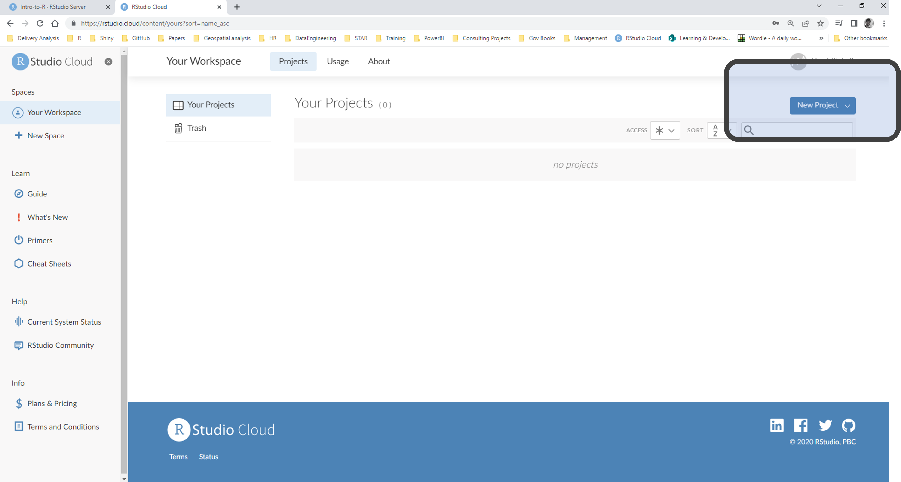
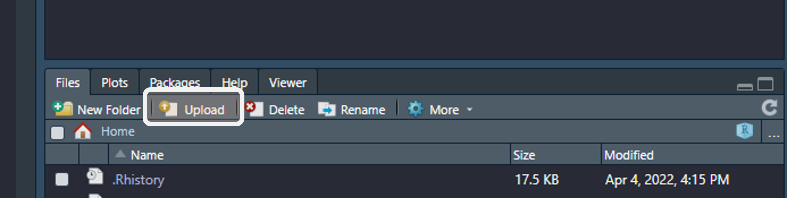
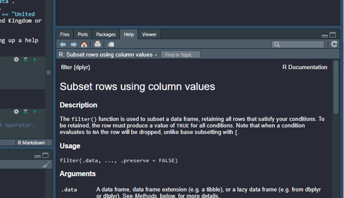

```{r setup, include=FALSE}

knitr::opts_chunk$set(echo = TRUE)
```

#### This session will cover:
* What is R and R Studio?
* Installing and using R Packages
* Reading in and filtering data
* Reformatting data and basic data cleaning
* An introduction to next session

## Why learn R?
* Makes you think in terms of a workflow which is
        * Repeatable to other cases
        * Reproducible
        * Easy to maintain
* Has many uses:
        * Dashboarding
        * Automated pipelines
        * Interactive reporting (RMarkdown)
        * Great data analysis functions
        * Great data visualisation functions
* Longevity: code becomes out of date very very slowly if at all
* Very active online community who are always innovating uses of R, and can provide support through online forums
* The breadth of what you can do: pretty much anything with data
* Web apps (shiny) and automated reporting (RMarkdown)
* Helpful support community
* Transferable skill
* Productivity - reproducible and **automatable** pipelines can lead to more time being spent on other areas


## Preparing for the training session

The session is run in a 'code-along' format, therefore **we recommend that you use a second screen if you have access to one** or a second device. This is because it will be easiest for you to see the teacher's screen and your own code at the same time.

You do not need to have R and R Studio installed on your computer. For the purposes of the training session we use RStudio cloud because all you need is a browser (we recommend Google Chrome or Microsoft Edge, definitely not Internet Explorer) so there is nothing to configure and no dedicated hardware, installation or annual purchase contract required. We will detail how to get R installed on your computer within Defra at the end of session 2.

You can sign up for a free "Cloud Free" account that allows you to create up to 15 projects, and use up to 15 project hours per month.

You can also run the training materials on an up to date local installation of R/RStudio (data is not offsen and is publically available or example data so you could also use your own personal machine), but there may be a few minor differences - the instructions below assume you're using RStudio cloud. 

When you're working through the materials, we recommend that you type the commands rather than using cut-paste.

**Before the training session, please make sure you have:**

**1) Have Google Chrome or Microsoft Edge installed on your computer.**

**2) Signed up for an account [here.](https://rstudio.com/products/cloud/)**

**3) Created a new project by clicking on the 'New Project' button, and given your project a name**




*Note that in RStudio Cloud you must work in a project.*

RStudio projects make it straightforward to divide your work into multiple contexts, each with their own working directory, workspace, history, and source documents. On RStudio Desktop you don't have to work in projects but WE STRONGLY RECOMMEND THAT YOU DO. You can read more about using Projects [here.](https://support.rstudio.com/hc/en-us/articles/200526207-Using-Projects) and see here for some more helpful background [here.](https://martinctc.github.io/blog/rstudio-projects-and-working-directories-a-beginner's-guide/)

If you've used R before, especially if some time ago, you may have come across code which uses the R function setwd("path/to/my/data"). This is not good practice and is not necessary when using projects.

Likewise previous R users may have come across the attach() function. Again you should not use this, it is not good practice.

**RStudio Cloud may not be suitable for official work purposes so please only use it for learning and training purposes.**

## What is R & R Studio?


#### What is R?
R is a computer language and environment for data manipulation, data analysis and graphical display. 
Importantly R is a free, open source software which means it is accessible to all and is continually  improving. There are other computer languages, notably Python, used in data science, but R is predominantely used due to it's easy to understand syntax and availability of specific data science/science/analytical packages. And certaintly within Defra the majority of data scientist/analysts will be using R. 

For more information on R vs Python you can see this article in [towards datascience.](https://towardsdatascience.com/python-vs-r-for-data-science-cf2699dfff4b)

#### What is RStudio?
RStudio is an integrated development environment (IDE) for R. It is a user interface for the R programming language making writing and running code much easier and more intuitive, as well as providing a host of addins to make your working life easier including: a console, syntax-highlighting editor that supports direct code execution (basically, colours your code and allows a user to select code to run on the fly), tools for plotting, history, debugging and workspace management. 

RStudio is available in open source and commercial editions and runs on the desktop (Windows, Mac, and Linux) or in a browser connected to RStudio Server or RStudio Server Pro. 


## Getting the training data into RStudio Cloud

Once you have the zip file of training materials, start up RStudio Cloud and go to your new project that you created above. In the bottom right window, under the Files tab, you'll see a button called Upload. Click on that, and follow the instructions to upload your zipped file. RStudio will automatically unzip the files and place them in your project. This includes the training documents themselves, which don't need to be available to R, but it's no harm to have them there. 



## Getting set up
Although we can type R commands into the console window (bottom left - useful for quick code snippets which we don't want to save), it's better to type commands into a script which we can save for future use. From a script we can run an individual line of code, a block of code or the entire script.

To set up a new blank script, click on the little plus sign in the top left of your screen underneath File.


It's good practice to put a name, a date and author in scripts.

```{r }
# Intro to R part 1
# Date: the current date
# Author: name
```
You can use # to add notes throughout your script, the # means R knows not to try and run the line as code. Except for the install.packages() command below, type the other commands below into your script. You can save your script regularly.

**Note: all code in this session is shown in a grey box as above.**

## Functions and packages

The way that we use R is to write code which utilises functions - functions being actions that we do to a piece of data, or object in R. But where do the functions come from? Packages. 

R Packages are collections of functions written and tested and published to an online storage website (repository), the official repository being CRAN. For a package to be published here, it needs to pass several tests that ensure the package is following CRAN policies. In simple terms - we trust packages that come from CRAN to be reliable. 

## Types of R programming

When you install R onto your computer you are using something called Base R. This is a version of R without any add-ons. It contains many useful functions and an easy syntax to understand, however to increase the effectiveness of R we will want to use and install packages. 

Due to R being Open Source many of the packages we can download and use have different ways of being used or written depending on authors preferences. For instance we may have to tell one function what column of a dataset to use first, then the data, and visa versa for another function from another package. This can make programming efficiently difficult. Additionally some packages may not work well with each other as functions from within packages may return an unexpected data type or data structure when transforming. 

Most people who use R now are using a group of packages called [the tidyverse.](https://www.tidyverse.org/) 


The tidyverse is a collection of packages which share common philosophies and are designed to work together. They were introduced to the world by Hadley Wickham (one of the biggest names in R) and mainly support a [tidy data](https://towardsdatascience.com/what-is-tidy-data-d58bb9ad2458) approach to working with data (more on that later). As the packages share syntax, philosophies and are designed to work together, they use making R alot easier and more intuative, and packages are updated frequently with new features meaning that analysts can stay up to date with best practices and emerging methods.

During this introduction we will touch on Base R, but will mainly focus on using the tidyverse. On thing to take away from this is that there **are many different ways of doing the same thing in R**, here we choose to do things the "tidyverse" way. 


## Installing packages

The first time you use a package on your computer you need to install it. This gets the package from the repository (generally CRAN) and puts it onto your computer (or your project in RStudio cloud).

You can do this with the install.packages() function. Type this command into the console, not in your script, as you won't need to re-run it if you come back to your script another time.

``` {r, eval = FALSE}
install.packages("tidyverse") 
```

Once you run the above you should never have to run it again (unless you uninstall R or delete some package libraries some how...) as the package will now be installed on your machine.

Here we are only going to install a group of packages from called tidyverse. Most of the time today we are going to use the functions built-in to R ("base R").

Note that when using RStudio Cloud, each separate project has its own package library, so if you create another project you will need to install your required packages from scratch. This is different from running R on your local computer (or in a virtual machine) where the default is a single package library available to any project. 

## Loading packages

library() is the command used to load a package into a R session. At first the difference between installing a package with install.packages() and loading a package with library() can be confusing. 

> "a package is a like a book, a library is like a library; you use library() to check a package out of the library" - Hadley Wickham
 
``` {r, message = TRUE}
# For example we can load a package called ggplot2
library("ggplot2") # we are back typing commands in your script now
library("magrittr")
# note no use of " " when using library command
# We could now use functions from ggplot2 to plot data
```

**Note: to run a line of code in R you click the line of code you want to run, then press Ctrl+Enter or click the Run button.**

When we use ```{r} library()``` we load all of the functions within a package, however we can also load one function from an installed package using whats called "namespacing". Some users prefer this way of calling functions as it also identifies what package the function comes from, allowing easier interpretation of code.

``` {r, message = TRUE, eval = FALSE}
# namespace example
ggplot2::ggplot()

# or

library("ggplot2")
ggplot()

# note - example uses empty functions 
```


## Code not working?
Common causes of error:

* no "" when needed (and vice versa)
* misspelling
* wrong number of ()
* wrong case: pretty much everything in R is case sensitive


### Warnings
Warnings are shown when R has encountered a problem processing some part of your commands, but can continue processing the other commands. However, the result might not be what you would expect, so you should carefully examine all variables used in the command that triggered the warning.


### Errors
Errors mean R cannot continue processing your commands and returns to the command prompt showing a brief description of the error.

## Session 1:

### Project Brief 

We have been tasked to compare the performance of the ESG indicator, "Forest area (% of land area)" between the UK and Netherlands as part of a data exploration exercise.


## Installing and loading packages, reading data into R.

### 1.1 Install and library packages
As this is the first time we are using R we will need to install our packages. We do this by running the function `install.packages`.


```{r, message = T, eval = FALSE}
## install packages
install.packages("tidyverse")
install.packages("janitor")
install.packages("readxl")
install.packages("readr")
```

A quick side-note on using lists in R... We can pass lists to most functions to repeat that function for multiple things. We use the syntax `c()` to do this, where within `c()` we provide a list, like so `c(1,2,3,4,5)`. A good example of this is installing all the above packages using one line...

```{r, message=F,eval=F}
install.packages(c("tidyverse", "janitor", "readxl", "readr", "pillar")) ## and so on
```

### Library packages

> "a package is a like a book, a library is like a library; you use library() to check a package out of the library" - Hadley Wickham

We need to library our packages in order to use their contents.

```{r, message=T, eval=T}
library(tidyverse)
library(janitor) 
library(readxl)
library(readr)

# note here that we cannot use the list c() operator with library, it must be done one at a time. 
```


Use the `read_xlsx` function from the `readxl` package to read your data (stored in a .xslx file) into R. 

Here we read the data in the .xlsx file into R and store it as what we call an object, or data frame - we will name this ESG_data. 

A data frame is an R data structure, basically a rectangular matrix of data where each column is named. Each column can have a different data type, but unlike Excel, everything in a single column must have the same data type. Integer, decimal, character are the most common data types. 

The <- symbol is called the assignment operator or just assign, it's just the less than (<) character immediately followed by the minus sign (-). Note the spaces either side of <-, these are not essential but help readability. But there must NOT be a space between < and -. Likewise there must not be a space between read.csv and the open bracket.

__KEYBOARD SHORTCUT__ Alt and - (press Alt and the minus sign together). This will produce the assignment operator correctly for you and save typing time.

```{r eval=T, message=TRUE}
ESG_data <- readxl::read_xlsx("./ESG_data.xslx")
ESG_data
```

## Explore Data 
### 1.2 - View data

There are various different ways to look at your data in R, try each of these and look at the differences between them. 

```{r, eval = F}

## Just use the object name
ESG_data

## Look at the top 5 rows
head(ESG_data, 5)

## Look at the top 20 rows
head(ESG_data, 20)

## Open data in a new window (xl spreadsheet like)
# View(ESG_data) 

## Shows a column wide view of data, notice the namespace loading the glimpse function from the pillar package
pillar::glimpse(ESG_data)

## Show column names in the order they appear in your data
colnames(ESG_data)

## If we want to view or select a particular column of a dataset we can use the $ operator to view that column.
ESG_data$`Country Name`

## Another useful function is unique() which shows us unique values from columns
unique(ESG_data$`Country Name`)

```

When we load data into R it takes the column names in the raw data format. Usually for programming we want to standarise this as one of our first cleaning steps. When naming columns yourself it's best to stick to upper or lower case characters, numbers (but not at the beginning of the name), the underscore and dot characters (_ and .). With this dataset, we will sort out these issues later.


## Wrangling data

Data wrangling is about getting your data in the right format to be able to analyse it. The next few steps take you through common data wrangling problems and how you can solve them in R. 

### 1.3 Deleting rows and columns 

Firstly we are going to standardise our column names using a function from the `janitor` package called `clean_names`. This converts all of our column names to lower case and any spaces to "_".

```{r}
colnames(ESG_data) ## before
```

```{r, eval = T}
ESG_data <- janitor::clean_names(ESG_data) 
```

```{r}
colnames(ESG_data) ## after
```

Now we can experiment with removing columns and rows. In base R we can do this using the `[]` format. A square bracket written directly after your data = [row, column]. For example I want to see the 2nd row and the 4th column of my data x I would do the following `x[2,4]`. We can remove values by putting a `-` before the reference. A blank space is ignored.

```{r, eval = T}
## delete rows
ESG_data_cleaning <- ESG_data[-1, ] #square bracket = [row, column]
ESG_data_cleaning # view the data and we can see the first total row is gone
ESG_data_cleaning <- ESG_data[-c(1:67), ] #square bracket = [row, column]

## delete cols
ESG_data_cleaning <- ESG_data[ ,-4]
ESG_data_cleaning # column 4 (indicator code) is deleted

## remove cols and rows in one step
ESG_data_cleaning <- ESG_data[-c(1:67), -4]
```

This initial concept is useful to understand, but within the real world and also tidyverse we would ordinarily filter data rather than delete it, and use a function `dplyr::select` to select particular columns of interest (again rather than deleting them). 


Lets try selecting data we want using tidyverse. For this example we are interested in comparing two countries, and one particular indicators, so lets get the data we need to filter our dataset.
Countries = United Kingdom and Netherlands.
Indicators = 	Forest area (% of land area).

> Note - It is best practice to select rows or columns by name, this can help avoid erroneous results if there are changes to the format of the data. This is one of the reasons why most prefer the tidyverse way of filtering and selecting data.

**But first... a note on getting help.**

`read_xlsx` was our first R function, but this is our first example of using an R function with multiple arguments (arguments are just anything within the brackets of the function name. Each argument other than the first is named, using the syntax argument = value. 
We are going to be passing two arguments to `dplyr::filter`. Here is the completed code:
```{r, eval = T}
## Filter country column first, call this variable ESG_filtered using the original data
ESG_filtered <- dplyr::filter(ESG_data, country_name == "United Kingdom" | country_name ==  "Netherlands") ## like in excel we can use the OR operator.
unique(ESG_filtered$country_name)
```

* Firstly, `ESG_data` is the data frame we're working on. We've not named this argument by convention, but we could have said `data = ESG_data`.
* Next using the `country_name == "United Kingdom"` argument we are saying that we want `country_name` only when it equals `United Kingdom`. 
* Taking this a step further we are going to use the `|` operator to signify *or*. Therefore the full `dplyr::filter(ESG_data, country_name == "United Kingdom" | country_name == "Netherlands")` translates to *filter the ESG_data data frame where the column country_name is equal to the United Kingdom or Netherlands.

Anyone using R, however experienced, is not going to remember the arguments of most of the functions they use. Fortunately it's easy to bring up a help page for any R function:

```{r eval = T}
?dplyr::filter
# or
help(filter) # and select the dplyr option
```

You will see information appear in the "help" tab in the bottom right tab in R Studio. 



Now, with the above in mind, lets filter our data.

```{r , eval = T}
## Filter country column first, call this variable ESG_filtered using the original data
ESG_filtered <- dplyr::filter(ESG_data, country_name == "United Kingdom" | country_name == "Netherlands") ## like in excel we can use the OR operator.
unique(ESG_filtered$country_name)

## We are only interested in one indicator so lets filter the indicator column overwriting our previous ESG_filtered
ESG_filtered <- dplyr::filter(ESG_filtered, indicator_name == "Forest area (% of land area)") ## to write equals we use ==
unique(ESG_filtered$indicator_name)

## Now if we look at our column names there are two columns that we aren't interested in...
colnames(ESG_filtered)
```

There is a "x67" column and a "x2050" which aren't useful to us in this dataset, so we will get rid of them. We will use -c here to denote we want to select everything BUT the columns listed.

```{r , eval = T}
ESG_filtered <- dplyr::select(ESG_filtered, -c(x2050, x67))

colnames(ESG_filtered)
```

We've kept our original data frame, ESG_data, and created a new intermediate data frame called ESG_filtered, in case anything goes wrong and we have to refer back to the original data without reloading the data again. 

## Tidy data

Making a dataset 'tidy' is part of the data wrangling process in R. 

Tidy data is a standard way of mapping the meaning of a dataset to its structure. A dataset is messy or tidy depending on how rows, columns and tables are matched up with observations, variables and types. 


There 3 main qualities of tidy data:

* Each variable forms a column
* Each observation forms a row
* Each type of observational unit forms a table

You can read more about tidy data [here.](https://r4ds.had.co.nz/tidy-data.html) and [here.](https://peerj.com/preprints/3183.pdf)

Of course it's better if your data are tidy in the first place, but we often have to deal with "untidy" data!

### 1.4 Pivot Data

We use the pivot_longer() function from the tidyr package here to make our data set tidy (our data is currently in a "wide" format, and therefore messy, so to clean it we can lengthen our data to ensure each column is a variable, each row is an observation, and each cell is a value).

We are going to use a new way of telling R what columns to pivot. In our dataset we want to pivot all of the year columns, so we have told our function `pivot_longer` that `cols = c(x1960:x2019)`. We are using the `c()` operator to select all columns between `x1960` and `x2019` using the `:` operator. 

```{r , eval = T}
ESG_tidy <- tidyr::pivot_longer(ESG_filtered, cols = c(x1960:x2020), 
                                names_to = "year", 
                                values_to = "land_area")

# similar to copying and pasting using rows to columns in excel
ESG_tidy # take a look
```

We create a new data frame called ESG_tidy. You'll see that the output of pivot_longer() is a "tibble" this is just a neat type of data frame. Don't worry about this for now, just think of it as a type of dataframe. 

In this example we have used a function from a package. In many cases, packages add functionality that is simply not present in base R. This is one of many cases where we COULD have used a function in base R (in this case that's called reshape). However in this case we use pivot_longer because it's so much easier to use than reshape. We will come across other situations in Session 2 where we choose to use functions in packages rather than their base R equivalents.


## Cleaning data
### 1.5 Removing values

Data cleaning is the process of preparing data for analysis by removing or modifying data that is incorrect, incomplete, irrelevant, duplicated, or improperly formatted. 

### Remove NAs
Actually we don't want the NAs at all, so we need to remove these but before doing that it's worth checking where the NAs are. Our first line of code does two things, reading from the inside the function is.na() returns a 1 if NA is found and 0 otherwise. The colSums() function is wrapped around is.na() and adds up the 1s so we can clearly see where the NAs occur. This is good practice because running the next line of code removes all NAs from the dataframe which in this instance is ok. In datasets with more columns you may have NAs in other columns but not on the same rows so applying na.omit() to a dataset may give unwelcome results. There are other functions that allow you to be more selective with handling NAs but that is outside this session.
```{r , eval = T}
colSums(is.na(ESG_tidy))
ESG_clean <- na.omit(ESG_tidy)

## being selective with our NA removal example
ESG_clean <- dplyr::filter(ESG_tidy, is.na(ESG_tidy$land_area) == F) # we filter ESG_tidy$land_area where is.na returns false (i.e. it doesn't contain an NA value)

```

### Removing unwanted characters
If we take a look at the `year` column we just made by pivoting our data we will see that it contains "x" then a year. We want to remove the x to create a numeric year column. 

We can focus our removing of the "x" values by using a function from the package `stringr::str_remove`. This uses the sytax of "string" (where do you want to remove a pattern from), and "pattern" (what do you want to remove).

```{r , eval = T}
ESG_clean$year
```
```{r , eval = T}
stringr::str_remove(ESG_clean$year, "x")
```

Given that we know the `year` column only wants to be numbers we could do a more general cleaning incase any spaces or other characters have crept in, we can do this using a bit of "regular expression" (regex) and another function from the `stringr` package, `stringr::str_extract` to extract all the numeric characters from the column, removing everything else.

```{r , eval = T}
ESG_clean$year <- stringr::str_extract(ESG_clean$year, "[[:digit:]]*$")
ESG_clean
```

This function again uses the same syntax as the `stringr::str_remove` but instead of a pattern to remove, we are giving it a pattern to keep. The pattern in this case translates to: all digits (`[[:digit:]]*`) until the end of the string `$`.

Don't worry about regular expressions/regex yet though, even for experienced R users regular expressions can be tricky but they are very powerful when dealing with text based datasets that you may encounter at some point. The above example is a simple introduction to what we can do with regex. 

### 1.6 Data types

R has a wide variety of data types including scalars (a single piece of data), vectors - a series of data of the same type (numerical, character, logical), matrices, data frames, and lists. 

R will automatically set data types when you read files into R, however, sometimes R will not do what you want so you may need to change.
Data types determine how the data is stored in your computer and how analysis/visualization will treat variables. You can read more about data types in R [here.](https://www.statmethods.net/input/datatypes.html)

Change variable data types, from character (text) to numeric. Once we pivoted our earlier dataset we created a year column which contained (before we cleaned it) and `x` and then a number like `1993`. When we run our dataframe (just run `ESG_clean`) we can see the datatype of the year column in character, the character strings which were there are why the column was labeled as a character rather than numeric. Using incorrect datatypes is probably one of the most common errors we get in programming, and will leave you with an error along the lines of `function x expected numerical but received character`. For instance we could pass a date column to a function as a character data type rather than a date type, or as in the example above a year column passed as a character rather than a numeric value.

Sometimes when we change a character column to numeric any cells containing characters will be flagged as NA, and you'll get a message from R that it's done this. This is why (in this case) we want to remove characters before changing the data type. In other cases we might be fine with just changing the datatype and ignoring the NA values, it all depends on what data you are using and the purpose. 

Let's give this a try...

```{r , eval = T}
ESG_clean$year <- as.numeric(ESG_clean$year) # Make year an integer
ESG_clean$land_area <- as.numeric(ESG_clean$land_area) # Make area numeric
```


And with all the above steps done we should have a nice clean dataset with which we are ready to work on some analysis and visualisation.

```{r , eval = T}
ESG_clean
```

## Summary of learning

Through this session we have explored (at a very high level)..
* What is R and R Studio?
* Installing and using R Packages
* Reading in and filtering data
* Reformatting data and basic data cleaning
* An introduction to next session

Next week we will be covering...
* Writing code using pipes - %>%
* Using If / If Else statements
* Joining different datasets together
* Visualisation with ggplot2
* Editing visualisations
* Exporting graphs and datasets


### End of Session 1!

#### Taster of session 2...


```{r, echo=TRUE, eval = T}
library(magrittr)

ESG_data <- readxl::read_xlsx("ESG_data.xslx") %>%
  janitor::clean_names() %>%
  dplyr::select(-c(x2050, x67)) %>%
  dplyr::filter(country_name == "United Kingdom" | country_name == "Netherlands",
                indicator_name == "Forest area (% of land area)") %>%
  tidyr::pivot_longer(cols = c(x1960:ncol(.)), names_to = "year", values_to = "land_area")

ESG_clean <- ESG_data %>%
  dplyr::filter(is.na(land_area) == F) %>% 
  dplyr::mutate(year = as.numeric(stringr::str_remove_all(year, "x")))

ggplot2::ggplot(ESG_clean, ggplot2::aes(x = year, y = land_area, color = country_name)) +
  ggplot2::geom_line()

```


# Help

For general help: 

* [R Cookbook](http://www.cookbook-r.com/)
* [R Cheatsheets](https://www.rstudio.com/resources/cheatsheets/)
* [Quick-R](https://www.statmethods.net/index.html)
* [R4 Data Science](https://stat545.com/)

For data organisation in spreadsheets [here.](https://peerj.com/preprints/3183.pdf)

For graphs:

* [ggplot2 book](https://ggplot2-book.org/index.html)
* [R Cookbook](http://www.cookbook-r.com/Graphs/) 
* [BBC R Cookbook](https://bbc.github.io/rcookbook/)

For outputting graphs see [here.](http://www.cookbook-r.com/Graphs/Output_to_a_file/) 

Defra community:

* Defra Coffee and Coding
* [Data Science Yammer](https://www.yammer.com/defra.onmicrosoft.com/#/threads/inGroup?type=in_group&feedId=16126135)
* R Training Group

Online community for help: 
* First try google. Most questions have been asked before. 
* [Stack overflow](https://stackoverflow.com/) 

 
