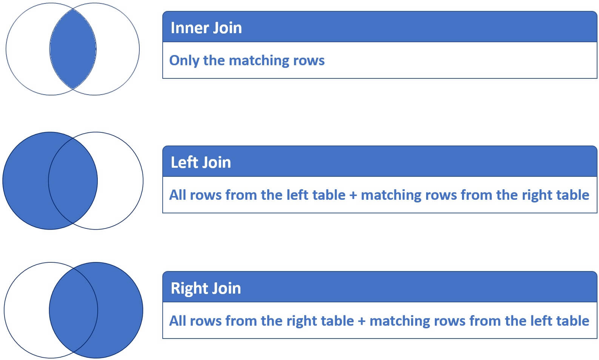
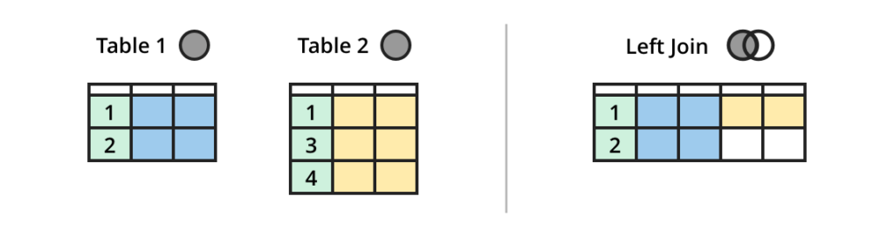
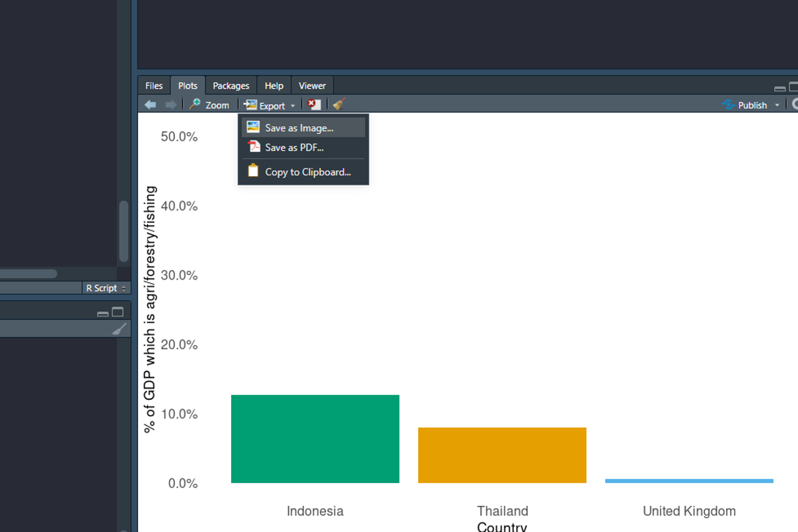

```{r setup, include=FALSE}
knitr::opts_chunk$set(echo = TRUE)
```

## Recap
In the first session we learnt how to extend Rs functionality to include additional packages and functions, how to get them in to R and use them. We then went over loading in and exploring our data, identifying what cleaning/wrangling steps needed to be done. We then used tidyverse functions to clean column names, filter our data, replace values, pivot and change data types. We finished with a cleaned dataset that would be ready for further analysis.

## In this session we'll cover...
* Writing code using pipes - `%>%`
* Using `If` / `If Else` statements
* Joining different datasets together
* Visualisation with ggplot2
* Editing visualisations
* Exporting graphs and datasets

## Let's get started

Presuming you were using RStudio Cloud for Session 1, just log into RStudio Cloud and click on the project you created there. Or, start a new script.

## Install packages and start a new script


We need to install some new packages which we didn't install in session 1. Once they're installed they're available any time we come back to our project. In our script we then use the library command to load the packages we need for our current R session.


```{r, eval=FALSE}
# These are just needed once for this project
# Just type these commands into the R command line or into an empty script and then run it
install.packages("ggplot2")
install.packages("writexl")
```

Now create a new R script in RStudio (File|New File|R Script), and immediately save it with a sensible name (e.g. Defra Intro R Session 2). Type the rest of the commands into this script.

```{r message=FALSE, warning=FALSE, include=T}
# Libraries
library(dplyr) 
library(readr)
library(janitor)
library(readxl)
library(ggplot2)
library(writexl)
```


## Read in our data

The `readxl::read_excel()` function can be used to read in both .xls and .xlsx file types.

`read_excel()`/`read_xlsx` (and `writexl::write_excel()`) focus on the simplest cases that users will need for 95% of the time: reading and writing rectangular datasets, buthere are other more complex R packages for interacting with Excel. For example reading individual cells or ranges, or creating excel files with complex formatting.

R can read a vast number of other file formats, and also link directly to databases. R packages to investigate include `foreign` and `haven`. See the [R data import manual](https://cran.r-project.org/doc/manuals/R-data.pdf) and the [cran task view on databases](https://cran.r-project.org/web/views/Databases.html)

With the `read_xl::read_excel` function we could specify which sheets in the workbook we want to read in, in this instance we didn't need this argument because there is only one sheet. Generally, it is best practice to include the sheets argument as if another sheet is added in the future our code won't break (if there is more than one sheet and we don't give R the `sheet` argument it will not know which sheet to read in and give us an error).

```{r} 
# read in .xlsx file
ESG_data <- readxl::read_excel("./ESG_data.xslx", sheet = "Sheet1")
```


## Using pipes

Last session we used a function `janitor::clean_names` to clean the names of our dataset after we imported it into R. We will do the same thing again here, but instead of naming two objects, can we condense reading in data and cleaning the object names together?


The pipe, `%>%`, is a powerful tool for joining (or piping) together multiple operations. It allows you to perform several actions sequentially on a dataframe or tibble. Generally when you have library and loaded a package from tidyverse the pipe syntax will be automatically available to you, but it comes from a package `magrittr`.  A quote describing `%>%` from the `R for Data Science` book -> *Pipes are a powerful tool for clearly expressing a sequence of multiple operations*.

__KEYBOARD SHORTCUT__ Ctrl and shift and m (press Ctrl and shift and m together). This will produce the pipe correctly for you and save typing time.

Placing a pipe between actions tells R to:
Carryout action 1 (e.g. filter the data) `%>%` then take the result and do action 2 (e.g. create another column) `%>%` then take this result to action 3 (e.g. multiply values in the new column by values from another column) and so on. 

It's our opinion that piping is best practice for coding in R, we  recommend adopting the 'tidyverse' style of coding as part of your own workflow in R, and using tidyverse functions even when base R equivalents are available. This is mainly because it makes your code easier to read and debug - this helps you and anyone else using your code. You will start to see this in action as we work through the following.

You can learn more about piping in R [here.](https://r4ds.had.co.nz/pipes.html)

**In action:**
Let's combine our reading in of data and cleaning of our object variable names in one step...

```{r}
ESG_data <- readxl::read_excel("./ESG_data.xslx", sheet = "Sheet1") %>% 
  janitor::clean_names()
```

Notice that I did not have to specify what to run `janitor::clean_names` on (there is nothing in the brackets). This is because a `%>%` takes the output from action 1 in the sequence and passes it directly to action 2, meaning R already knows what object to run the function on.

## Filter and wrangle data using lessons from last session 
Here we're going to use the pipe operator to conduct some our basic cleaning and wrangling steps from last week. We will:

* Filter data using the `|` operator to signify "OR"
* Select our columns of interest
* Pivot data

```{r}
ESG_tidy <- ESG_data %>% 
  dplyr::filter(country_name == "Indonesia" | country_name == "Thailand" | country_name == "United Kingdom") %>% 
  dplyr::filter(indicator_name == "Agriculture, forestry, and fishing, value added (% of GDP)") %>% 
  dplyr::select(-c(x2050, x67)) %>% 
  tidyr::pivot_longer(cols = c(x1960:x2020), names_to = "year", values_to = "agri_forest_fishing_percent_GDP")
```

Translated to English, in the above we have taken our ESG data and we have filtered it for countries of interest `%>%` taken the output of that and then filtered for our indicator of choice `%>%` dropped columns we are not interested in from our dataset `-c(x2050, x67)` `%>%` and then pivoted all of our "year" columns the column names becoming a `year` column and values becoming the `agri_forest_fishing_percent_GDP` column.


## Clean data using lessons from last session
Again, remembering from last session we are removing our "x" values from the `year` column of our dataset, and then changing the data types.

```{r}
ESG_clean <- ESG_tidy %>% 
  dplyr::mutate(year = stringr::str_remove(year, "x")) %>%
  dplyr::mutate(year = as.numeric(year)) %>%
  dplyr::select(-c(indicator_name, indicator_code))
```

You will notice above we have introduced a new function `mutate` which comes from the `dplyr` package. This function is necessary when you want to alter or create a new column within a `%>%` sequence. We call see all I have done is told R that `year` now equals stringr::str_remove(year, "x"). This would be the same as `ESG_clean$year <- stringr::str_remove(year, "x"))`.


## Joining datasets to create a new dataset

There are many different ways to join datasets in R, depending on what you are trying to achieve with your join. Base R has a function called merge which can achieve various types of join. However we're going to skip straight to the tidyverse - within the dplyr package there are a number of join functions that enable you to create a new dataset from the whole or parts of other datasets joined together. We are going to the left_join() function from the join family, type ?left_join in your R console and look at the  help file and you'll see the join choices available with some worked examples. 

You can read more about all of the types of join and how to use them  [here.](https://dplyr.tidyverse.org/reference/join.html) The [data wrangling cheatsheet](https://rstudio.com/wp-content/uploads/2015/02/data-wrangling-cheatsheet.pdf) is also a useful to look at when choosing which join function to use.

A left join takes all the values from the first table, and looks for matches in the second table based upon one or more a unique identifiers or keys that are common in both tables. Where it finds a match, it joins the data from the second table to the first table. Where no matches exist then R adds missing values labeled NA. 

The figure below shows two tables, 1 and 2, the left_join() and the resulting table after a left join. Can you think how this example might look
different if we called right_join(A, B, by = "id")? 






__Creating a new dataframe__
We have a data set to import which includes some additional data we want to join to our `ESG_tidy` dataframe.

```{r}
ESG_emissions <- readxl::read_xlsx("ESG_C02_emissions.xlsx")
```

__Combine the new prices dataframe with the arable dataframe using the left_join() function__
```{r}
## lets view the data to see what columns we will have to match
ESG_clean
ESG_emissions
```

We can see that both datasets share a few columns, and when these columns are combined together they effectively form a unique identifyer for that row, for example `country_code` + `year` + `agri_forest_fishing_percent_GDP`. This means that we need to join `by` (as described in the documentation) multiple columns in our data so R knows which rows could match which. To put this into practise... 

```{r}
## We will have to join by all columns that match to make sure we match the correct rows (no unique row identifiers)
ESG_and_emissions <- dplyr::left_join(ESG_clean, ESG_emissions, by = c("country_code", "year", "country_name"))

## And we can also do this in a pipe
ESG_and_emissions <- ESG_clean %>% 
  dplyr::left_join(ESG_emissions, by = c("country_code", "year", "country_name"))

ESG_and_emissions

```
We can see that we have now joined the `tC02_per_capita` onto our dataset.

## IF statements

If statements can be very useful. Often, you want to make choices and take action dependent on a certain value.


The syntax of the R if statement is:
```{r, eval= FALSE, echo = T}
if (test_expression) {
statement1
} else {
statement2
}
```

If the `test_expression` is `TRUE`, the statement gets executed. But if it is `FALSE`, the `else` statement is executed.

```{r}
x <- -5

if ( x > 0) {
print("Positive number")
} else {
print("Negative number")
}
```

Note: that else must be in the same line as the closing braces of the if statement.

### What if we want to test a list of numbers and return whether each of them is true or false?

Well lets assign `x` to a list of numbers and try to run our code again.

```{r}
x <- c(-5,-4,-3,-2)

if ( x > 0) {
print("Positive number")
} else {
print("Negative number")
}
```
We get an warning `the condition has length > 1 and only the first element will be used[1] "Negative number"`. In simple terms this is because `if` and `else` in the above format can only test one statement at a time, when we provide this list to the `if` statement R does not know how to run it and instead will just print the last statement, in this case `Negative number`. 

To get around this we can use a function called `ifelse` which functions in exactly the same way as the above but has a slightly different syntax.

```{r}
x <- c(-5,4,3,-2)

?ifelse

ifelse(x > 0, "Positive Number", "Negative Number") 
```
You can see we return a vector of responses, each the result of a value from the list x being run through the ifelse function. Let's use this in a real world example.

## Using ifelse on data

Here we combine a dplyr pipe with the `ifelse()` function, which is a handy short version of `if(){}else{}`. We are going to assign a continent to our countries.

```{r}
ESG_and_emissions <- ESG_and_emissions %>% 
  dplyr::mutate(continent = ifelse(ESG_and_emissions$country_name == "United Kingdom", "Europe", "Asia"))

unique(ESG_and_emissions$continent)
```

Now we can see we have a continent column in our dataset.

As a bonus piece of knowledge, there is also a function in tidyverse which, when creating complex `ifelse` statements, can be easier to interpret. We can use the function `dplyr::case_when`.

```{r}
ESG <- ESG_and_emissions %>% 
  dplyr::mutate(
    continent = dplyr::case_when(
      country_name == "United Kingdom" ~ "Europe",
      country_name != "United Kingdom" ~ "Asia"
    )
  )
```

## Summary of data manipulation

In the above example it's debatable whether the pipe + `dplyr::mutate` sequence is any better / easier than assigning a new column using this sytanx `data$new_column <- statement`. But for more complex sequences of manipulation, pipe + dplyr is generally simpler and more powerful. It also translates seamlessly to the situation where your data are in a database, there is a close relationship between dplyr pipes and underlying SQL code.

Remember the main dplyr verbs:

* `filter` for selecting rows based on one or more conditions
* `select` for choosing columns by name - keep this or remove that
* `mutate` for creating new columns (or editing an existing column) based on some criteria.

The last of the main dplyr verbs, one we haven't used is `arrange` for sorting data. There's alot more to dplyr and the tidyverse, for more info see the tidyverse website or, my favorite resource, the [R for Data Science](https://r4ds.had.co.nz/index.html) book.

## Exporting dataframes
Exporting data in R is as easy as importing and you have a wide range of file type options available ranging from the common to exotic. We could export data in the R.data format (small and easily readable by R), but more commonly we would export as a .csv or .xlsx.

Lets use the `write_xl` package to export our data as a `.xlsx` file. And `readr` to export as a .csv
```{r}
writexl::write_xlsx(ESG, path = "ESG_clean.xslx") # need to include file extension

readr::write_csv(ESG, file = "ESG_clean.csv")
```


## Making graphs
Now that we have our cleaned data and have exported it to share, we should create some visuals to go along side our data.

One of the many great things about R, and one of it's early identified strengths are its graphical capabilities. These continue to grow as developers release new and updated plotting and also mapping packages and the sky is the limit when it comes to design and level of user interactivity. For now we will focus on the ggplot2 package.


### ggplot2

ggplot2 is a package dedicated to data visualization and allows you to build almost any type of chart. It can greatly improve the quality and aesthetics of your graphics, and will make you much more efficient in creating them. The way that ggplot2 works is based on the concept of the Grammar of Graphics by Leland Wilkinson (1999), that's what the gg stands for.

Note that the package is called ggplot2, but the most commonly used command in the package is ggplot - ie `ggplot2::ggplot()`

### Basic line graph 

Here we are creating a plot object called `esg_line_plot`. We take the `ESG` dataframe and pipe this to ggplot(). Within that function we set the "aesthetics" that we want to map aspects of our data on to, in this case `year` on the x-axis and `agri_forest_fishing_percent_GDP` on the y-axis. We also want to map the group (country name) to a `group` aesthetic, and we can do the same for `colour` to colour our lines by country. To plot an actual graph, we will add a `+` and on a new line add our function to create a graph, in this case it is `geom_line()`. 


```{r}
esg_line_plot <- ESG %>% 
  ggplot(data = ., aes(x = year, y = agri_forest_fishing_percent_GDP, group = country_name, colour = country_name)) + 
  geom_line()

esg_line_plot

```


ggplot() is used to construct the initial plot object, and is almost always followed by + to add other components to the plot in layers. What will the plot look like if you change `geom_line()` to `geom_point()`? 

A way I find useful to understand the ggplot syntax is to think of it as layers. First we add our base data, next we add our visual graph layer, then we can control any other graphs we want to layer on top (for instance a bar over a line), then the legend and other options.

For a full list of the graph functions (as well as other functions) see the ggplot [website](https://ggplot2.tidyverse.org/reference/#layers).

To take the above a little further we could combine filtering our data with creating a bar chart, giving us a view of a particular year.

```{r}

esg_bar_plot <- ESG %>% 
  dplyr::filter(year == 2019) %>% 
  ggplot(aes(x = country_name, y = agri_forest_fishing_percent_GDP/100, fill = country_name)) + 
  geom_bar(stat="identity") 

esg_bar_plot

```


### Change axis labels, axis range, themes and colours 

R has extremely customizable visualisations. Most are self explanatory and desciptions can be found in the documentation. One which is not so obvious is themes. These allow you to control the non-data elements of your ggplot; the system does not affect how the data is rendered, or how it is transformed by scales, but makes the plot look nicer or match an existing style guide. There are alot of themes available, and you can even create your own or modify an existing one. Here just we're going to apply the theme_minimal which will remove the grey background. 

We take the esg_bar_plot object and change the colour palette then label our axes, our theme and also change the y-axis range as well as axis text size and units. 


```{r}
## compare the bar chart from before to after
esg_bar_plot

## Lets make our plot more colourblind friendly by creating a custom colour palette. This is just a list of colours in the HEX format.
colourblind_palette <- c("#009E73", "#E69F00", "#56B4E9", "#F0E442", "#0072B2", "#D55E00", "#CC79A7")

## Add other elements (or layers) to our existing plot using the + syntax
esg_bar_plot2 <- esg_bar_plot +
  labs(x = "Country",
                y = "% of GDP which is agri/forestry/fishing") + # labels
  expand_limits(y=c(0,0.5)) + # changey limits
  scale_fill_manual(values = colourblind_palette) + # how do we want to colour our plot? Manually.
  theme_minimal() + # set the theme of the plot to "minimal". See the ggplot guidance using ?
  theme(legend.position = "none", # no legend
                 panel.grid.major = element_blank(), # no lines
                 panel.grid.minor = element_blank(),
                 axis.text.x = element_text(size = 12), # text size
                 axis.text.y = element_text(size = 12),
                 axis.title.x = element_text(size = 13),
                 axis.title.y = element_text(size = 13)) +
  scale_y_continuous(labels = scales::percent) # change the unit of the y axis using the scales package.


```


## Exporting a ggplot graph

A simple way to export any graphic is by point and click in RStudio. Click on Export in the Plot viewer pane and you can either copy the graph to the clipboard or save it as an image file. 



But for reproducibility it's probably better to save your graphic as a file directly from your R script. It is better to think proactively about the size you would like your final image to be, as this affects the text size in your plot.

```{r, eval=FALSE}
ggsave(filename = "esg_final_plot.png", plot = esg_bar_plot2, width = 15, height = 12, unit = "cm")
# if don't specify width, height and unit will save in proportions of the plots window in the bottom right
```


## End of Introduction to R course! 

## How to get R on your desktop in Defra

This process has been famously difficult in Defra, but is getting better. I may take a while to install, and you won't have access to version control software such as Git, but you will have R and be able to run code and install packages.

1. Following the guidance in [this article on the intranet](https://defra.service-now.com/sp?sys_kb_id=8058f01f1b2a0d142bc442ead34bcbb9&id=kb_article_view&sysparm_rank=1&sysparm_tsqueryId=a23367b91bf6c9d42bc442ead34bcbf2) we must apply for software to be installed through this [service catalogue item](https://defra.service-now.com/sp?id=sc_cat_item&sys_id=7f359c1ddb14e01428c8593cd39619ac&referrer=popular_items).
2. We need to make an application for both R, and R Studio seperately.
3. In the notes field, request for the application to be installed *on your C: drive else the software will not work*.
4. Once your line manager has approved the request the software should be installed within the week, if it is not reach out to IT. 5. Once installed, 

# Help

For general help: 

* [R Cookbook](http://www.cookbook-r.com/)
* [R Cheatsheets](https://www.rstudio.com/resources/cheatsheets/)
* [Quick-R](https://www.statmethods.net/index.html)
* [R4 Data Science](https://stat545.com/)
* [Advice on using R](http://r-posts.com/advice-to-young-and-old-programmers-a-conversation-with-hadley-wickham/)

For data organisation in spreadsheets [here.](https://peerj.com/preprints/3183.pdf)

For graphs:

* [ggplot2 book](https://ggplot2-book.org/index.html)
* [R Cookbook](http://www.cookbook-r.com/Graphs/) 
* [BBC R Cookbook](https://bbc.github.io/rcookbook/)

Defra R community:

* [Defra Data Science Yammer](https://www.yammer.com/defra.onmicrosoft.com/#/threads/inGroup?type=in_group&feedId=16126135)
* [Data Science and Analytics Hub - DASH](https://defra.sharepoint.com/sites/Community448/SitePages/Welcome-to-the-Data-Science-Centre-of-Excellence.aspx?xsdata=MDN8MDF8fDlhMzkxZWEwNTQ1ZjRhYTA5ZGFkYWZjZWJkYzg5NGVkfDc3MGEyNDUwMDIyNzRjNjI5MGM3NGUzODUzN2YxMTAyfDF8MHw2Mzc3MzUyMjEzOTc4NDkyMDh8R29vZHxWR1ZoYlhOVFpXTjFjbWwwZVZObGNuWnBZMlY4ZXlKV0lqb2lNQzR3TGpBd01EQWlMQ0pRSWpvaUlpd2lRVTRpT2lJaUxDSlhWQ0k2TVRKOQ%3D%3D&sdata=WFR4MGJxZWY4ZXN3VXFWQ3ltWnJLZy9PSkxLbS9qdHlvYzRUdDZSaDdWST0%3D&ovuser=770a2450-0227-4c62-90c7-4e38537f1102%2CFriederike.Bolam%40defra.gov.uk&OR=Teams-HL&CT=1637925395195)
* R Training Group

Wider online community 

* Google!
* [Gov Data Science slack workspace](govdatascience.slack.com) #r channel
* [Stack overflow](https://stackoverflow.com/)
